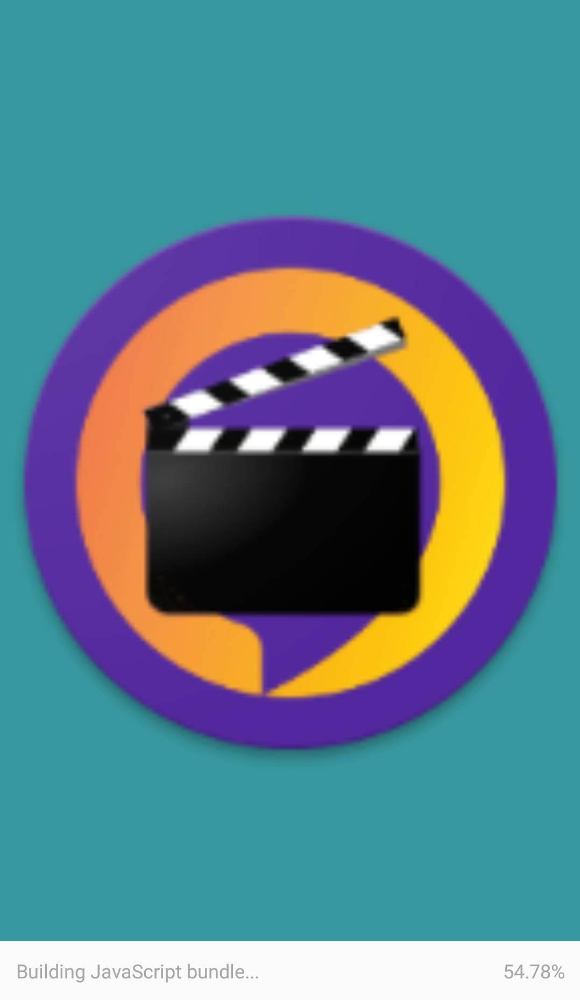
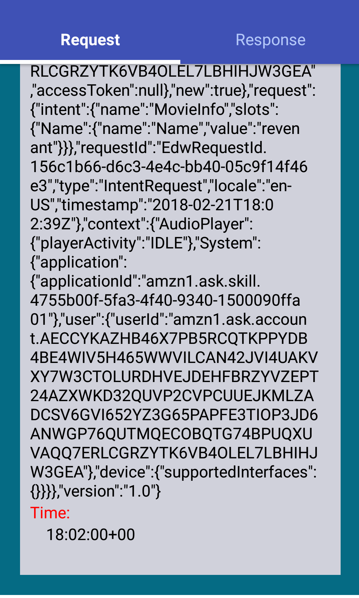
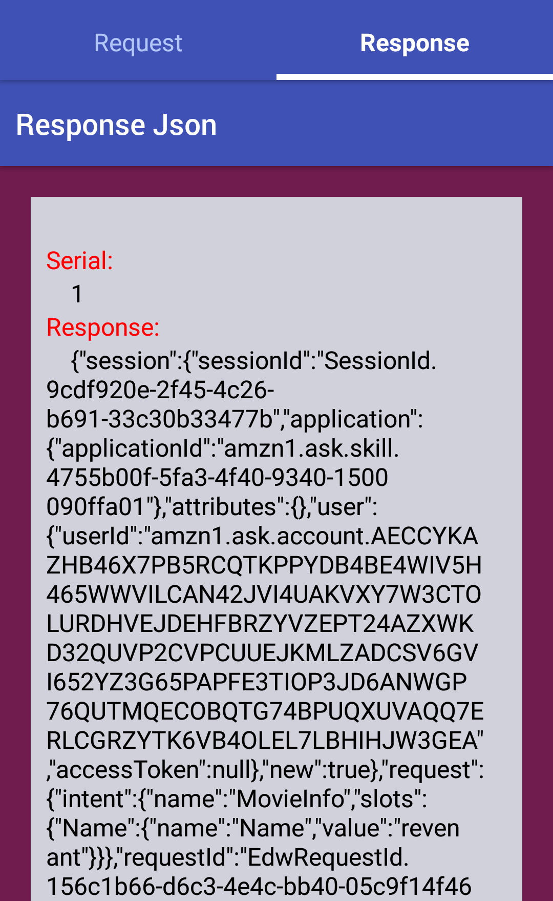

## TMDB ALEXA LOGS

 > This app is part of HPDF Final Submission
 > of React Native part.
 > Logs made to alexa the Movie Database custom skill
 > will be show in this app.

 Dowload the
 [apkhere](https://drive.google.com/file/d/1Ic3K8_6Kq1xuLtqek154yeU3Bg_InLzw/view?usp=sharing)

 ## Steps

 * Clone this repo.
 * cd to react-native/
 * Change the cluster name in Src/hasuraApi.js
 * run `npm start`
 * open the app in expo.
 * Check for the console logs about the cluster status.
 * If the cluster is waking try again after some time.
 * Once the app is opened click `TMDB Alexa logs`
 * Fetched JSON will render in the app.


 ## Few Tips
  If the "Check your table permission error occurs it indicates that the cluster may awake at this time.Please be patient and try after some time.
### `npm start`

Runs your app in development mode.

Open it in the [Expo app](https://expo.io) on your phone to view it. It will reload if you save edits to your files, and you will see build errors and logs in the terminal.

Sometimes you may need to reset or clear the React Native packager's cache. To do so, you can pass the `--reset-cache` flag to the start script:

```
npm start -- --reset-cache
# or
yarn start -- --reset-cache
```

#### `npm test`

Runs the [jest](https://github.com/facebook/jest) test runner on your tests.

#### `npm run ios`

Like `npm start`, but also attempts to open your app in the iOS Simulator if you're on a Mac and have it installed.

#### `npm run android`

## SCREENSHOTS
 
 
 
 
 

